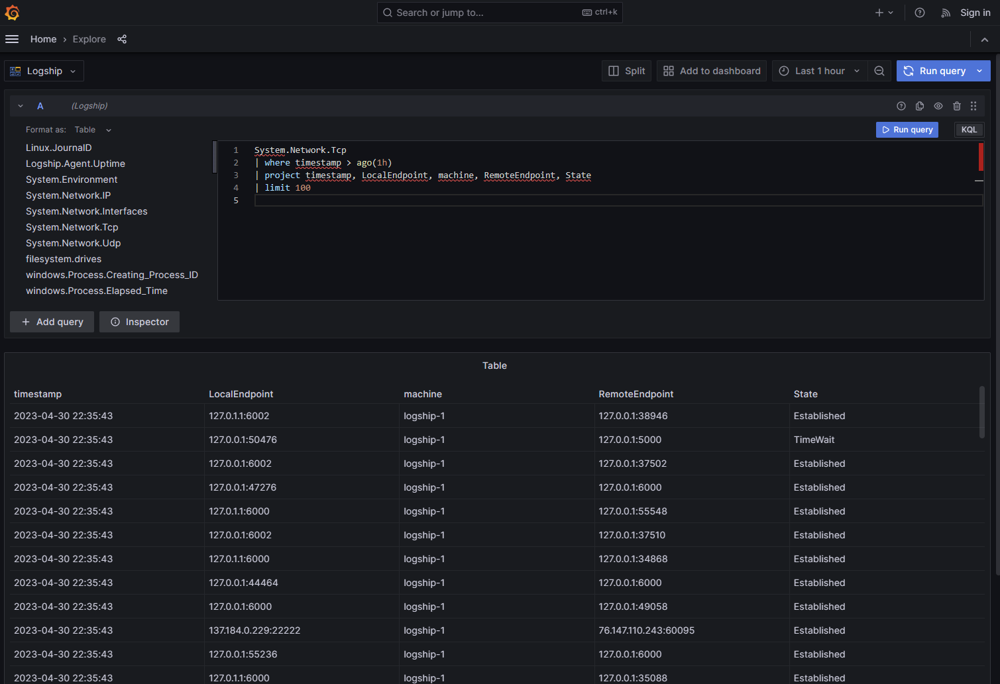

It's a big day for us here at the ship, because you're no longer stuck to our bespoke user interface. Grafana is now be exposed by default on Logship deployments.

Try out the query [explorer!](https://grafana.logship.io/explore)
Or check out our demo [dashboard!](https://grafana.logship.io/d/ddc3e1b3-a1b8-47f5-807c-808e654e1361/default?orgId=1&from=now-30m&to=now)

Be warned, that this feature is brand new and there are some quirks. Charts don't really work yet... you can create one, but there are some funky issues with multiple series. Our engineers are on it.

