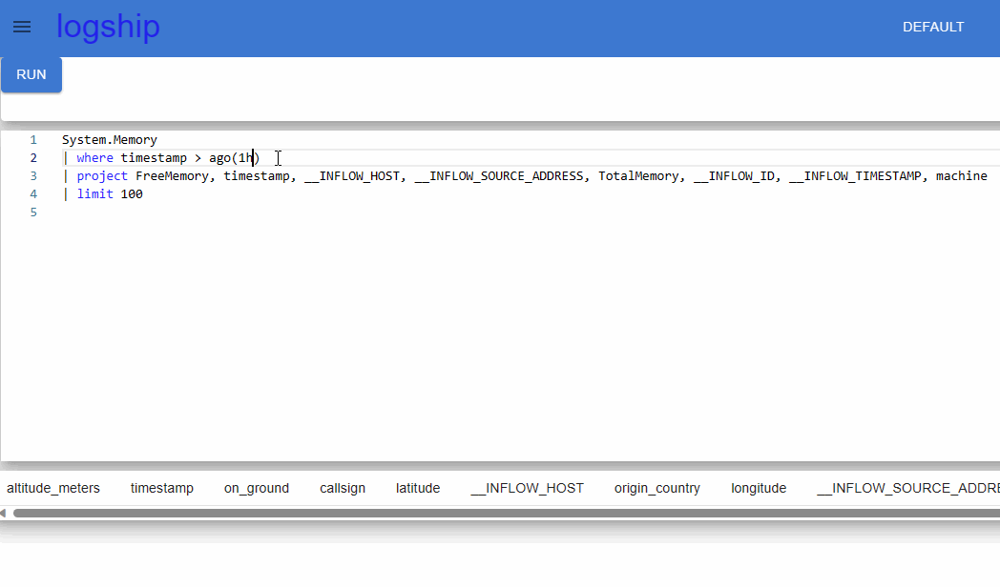
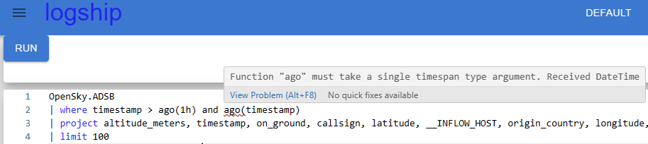

TLDR; Basic language parsing support is now available in the editor

# We've taken our first go at syntax highlighting
Errors are now highlighted in the query editor. Be warned, this a new and somewhat rocky feature, but we'll be investing further and further on getting rich error handling.

This support is not yet available in grafana, or in the logsh CLI.

## Technical details
The first go at query parsing is non-optimal. All of the parsing is run client side, and uses the exact same codepath used by the query execution framework. The core difference being that the query is not executed after being parsed.

Because of this, the parser always exits on the first error... (no need to parse the whole query if we no it's bad). We're looking into improving this, while keeping as much of the code consistent between the executor and the parser.