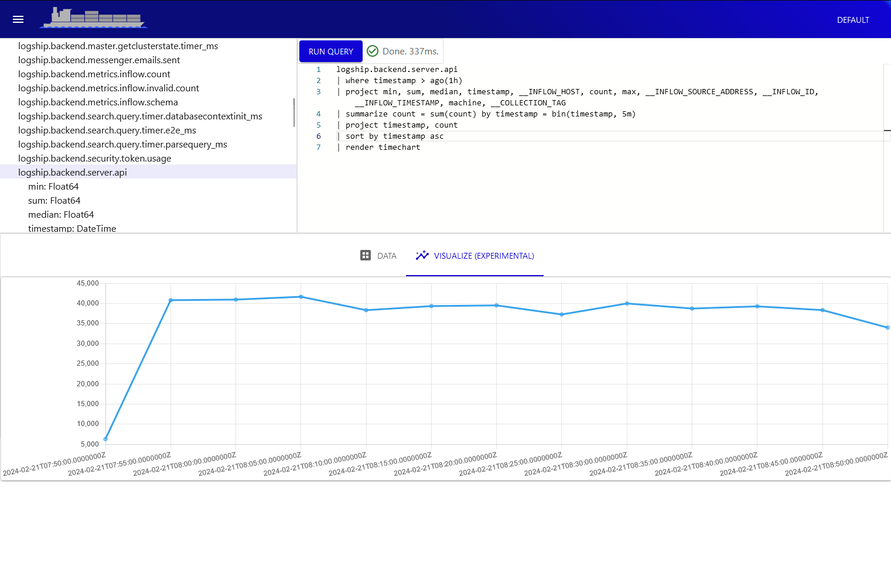
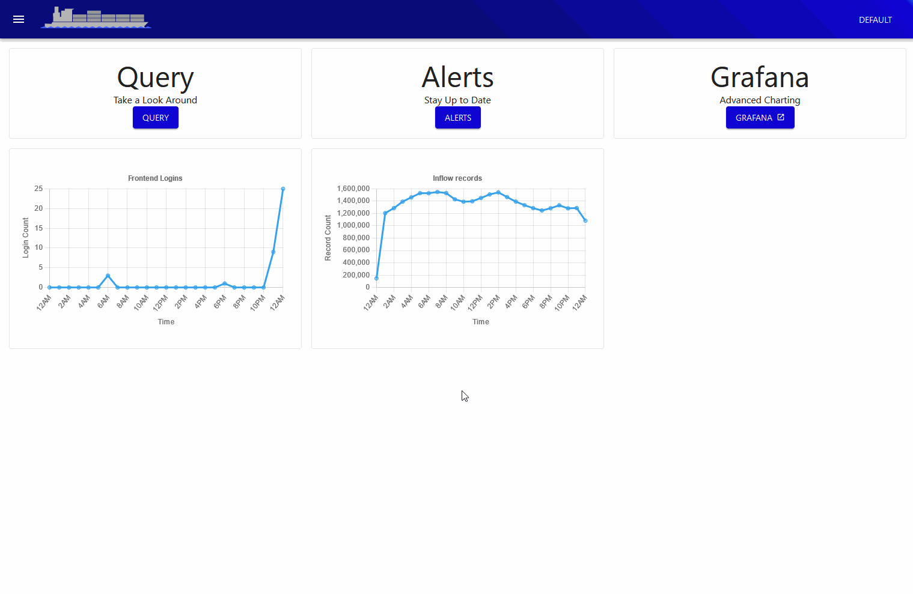

Experimental timeseries plot rendering is now available in the UI! 



This unlocked the `render` opertion, which is only available as the last expression in a query.

```kusto
table_name
| render <chart-type>
```

Support is still limited, and only the "timechart" option is available. We plan to expand this, and enable more configuration options (axis names, grouping, etc)

```kusto
logship.backend.server.api
| where timestamp > ago(1h)
| summarize count = sum(count) by timestamp = bin(timestamp, 5m)
| project timestamp, count
| sort by timestamp asc
| render timechart
```

A quick demo is available below



Enjoy! Feedback welcome. 

:heart: The logship team.