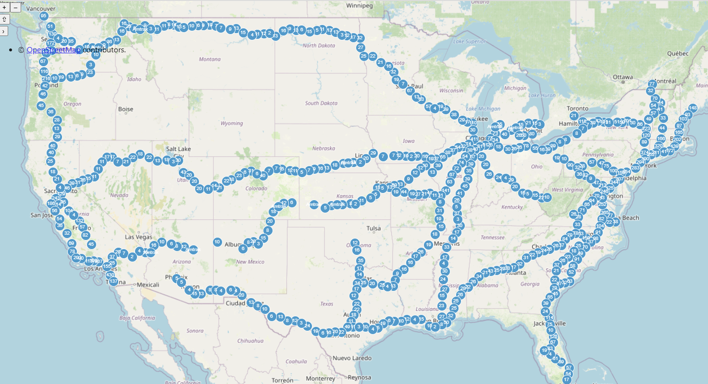

We're excited to announce the integration of map visualization capabilities in Logship's dashboard and analytics interface. This new feature enables geographic data visualization through an intuitive map rendering system.



The new map rendering functionality can be implemented using a straightforward Kusto query syntax:

```kusto
table_name
| render map2d with (title = 'Map Title')
```

To demonstrate this feature's capabilities, here's a practical example using real-time Amtrak train location data:

```kusto
GTFS.VehiclePositions
| where timestamp > ago(1h)
| project timestamp, __COLLECTION_TAG, __INFLOW_HOST, __INFLOW_ID, __INFLOW_SOURCE_ADDRESS, __INFLOW_TIMESTAMP, congestionLevel, currentStatus, currentStopSequence, feedName, occupancyStatus, positionBearing, positionLatitude, positionLongitude, positionSpeed, routeId, stopId, tripId, vehicleId, vehicleLabel, vehicleLicensePlate
| where feedName == 'Amtrak'
| summarize count = count() by latitude = bin(positionLatitude, 0.001), longitude = bin(positionLongitude, 0.001), label = feedName
| render map2d with (title = "GTFS Vehicle locations")
```

Here's a brief demonstration of the feature in action:


We welcome your feedback and suggestions as we continue to enhance our visualization capabilities.

Best regards,
The Logship Team