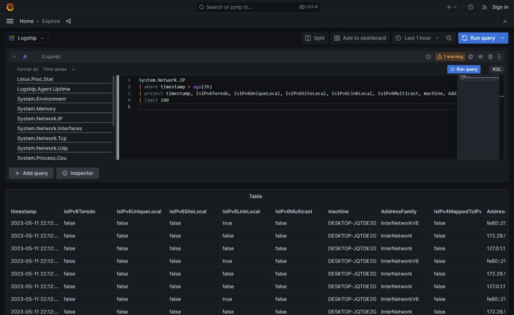

# Single Node Deployment

Initial setup

This article will guide you through an initial setup of the logship server, database, agent, and grafana datasource. At the end of this tutorial, you'll have a working docker-compose deployment of the entire logship ecosystem on your local machine.

## Prerequisites

In this example, you can either use docker-compose or podman-compose. Both work great. This tutorial works on both Linux and Windows (WSL2). It was tested on WSL2, since we're a windows show

## Setup

1. Check out a copy of the logship deployments repo, available [here](https://github.com/logsink/logship-deployments)
```
git clone https://github.com/logsink/logship-deployments.git
```
2. We're going to start with the most basic single node deployment. 
        Note. You'll need to authenticated with the github container registry... since we're a startup and don't have a better place to keep our stuff. `docker login ghcr.io/logsink`. Give it a PAT token.
```
cd src/docker-compose/single-node
```
3. Make sure you have all of the latest containers available.
```
docker-compose pull 
```
4. Create the environment!
```
docker-compose up -d
```

## Try it out
1. Open up the local grafana deployment at [http://localhost:3000](http://localhost:3000)
2. Try out the explore page!

3. Clean it up with `docker-compose down`