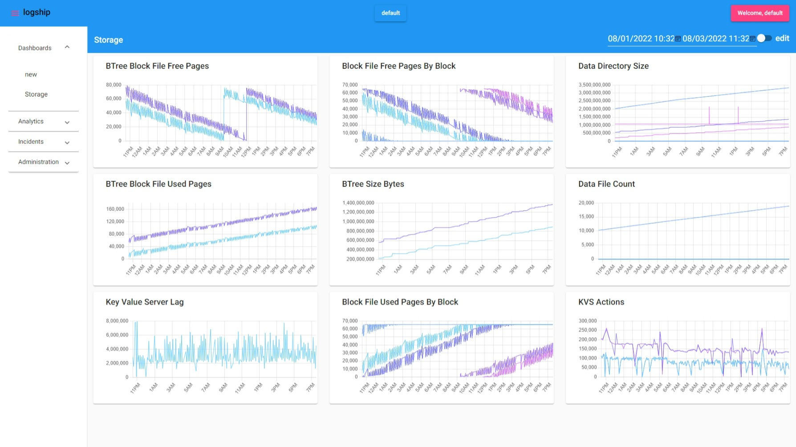

# Welcome

Welcome to logship, the most scaleable metrics, logging, and analytics platform available.

## What's Logship?

Logship is an all-in-one logs aggregation, visualization, and query platform; designed to deploy onto commodity user-provided infrastructure.

Logship provides:
* A horizontally massively scaleable query engine for timeseries data
* A Kusto based query interface
* A UI for data management, configuration, and control
* An open source agent for metrics and logs ingestion

All of this, deploys onto your own datastructure.

### Why?
So why did we even build this... Well, we're tired of cloud based metrics and analytics services drawing people in, owning their data, and charging big bills. Your data is your own. Why wouldn’t it be. Logship services are designed to run on offline infrastructure, which means you’re in control. 

### Don’t pay to play
As you grow, Logship scales with your hardware. You don’t pay more. 

### Infinite horizontal scale
The more machines you have, the more Logship can parallelize your query workloads.

The Logship ecosystem is made up of 4 components:
* Logship UI
* Logship Management Service
* Logship Database
* Logship Agent