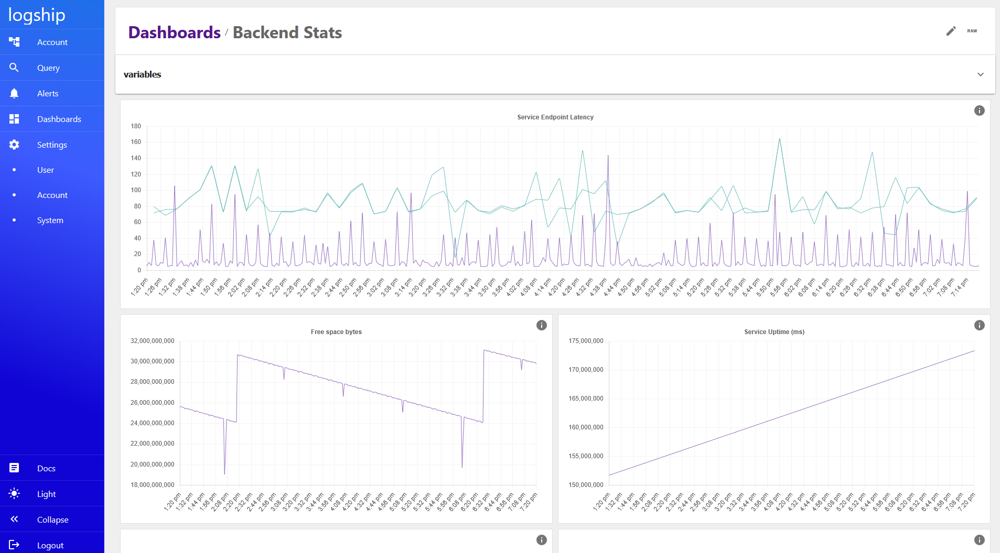

# Products

## Logship

Logship is our flagship platform—a robust, scalable, and highly available solution for metrics, logging, and analytics. Engineered for simplicity in deployment on commodity infrastructure, Logship is designed to meet the diverse needs of both small businesses and organizations that require the highest standards of data security and performance. With Logship, regain full control over your critical data while avoiding the constraints of traditional SaaS models.

### Pricing
* **Small Deployments:** Free for deployments up to 16 cores—ideal for most small business needs.
* **Larger Deployments:** Please contact us for tailored pricing options based on your specific requirements.

## Custom Solutions and Consulting
Our team offers expert consulting and custom software solutions designed to tackle your most complex technical challenges. Whether you need to integrate advanced sensor technologies, deploy on edge devices, or develop solutions for specialized applications, we bring the expertise and creativity necessary to turn your ideas into reality. Contact us to discuss your unique project requirements. [Contact](/contact)

## For U.S. Government Customers

We are proud to partner with U.S. government agencies to deliver secure, reliable, and cost-effective solutions that maintain the highest standards of performance and compliance. Our dedicated support and flexible pricing options are designed to meet the stringent demands of government operations.